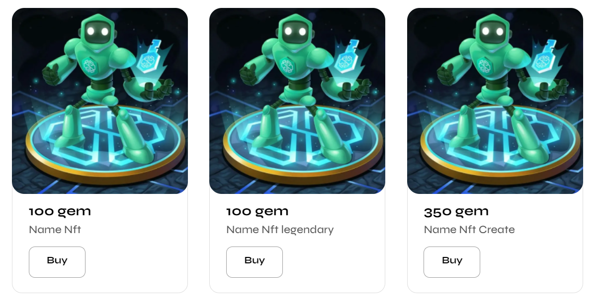

# Components:
## 1.Achievement:
### Блок достижений в профиле

## 2.AdminProfile:
### Большая фотка профиля на странице админа

## 3.Footer:
### Просто футер. Может принамать параметр menuDropDown. Параметр нужен для использование футера в выпадающем меню (burger menu)

## 4.Header
### Просто верхушка страницы

## 6.NftItem
### Элемент списка нфтишек. Должны передать в него обЪект с парамертами urlImg, price, title, id?

## 5.NftList
### Список нфтишек, которые можно купить

## 7.ProfileBlock
### Общий блок профиля. Содержит в себе Меню и то, что показывается при выборе пункта меню (Ачивки, коллецию nft и тд)

## 8.ProfileMenu
### Меню профиля

## 9.ScrollingListNft
### Скроллинг элементов в блоках, которые находятся в основном блоке профиля. Может принимать два необязательных параметра twoRows и delisting. Если передается twoRows, то список получается ограничение по строкам - 2. Когда передается delisting, появляется кнопка Delisting у элементов

## 10.Search 
### Отслеживает то, что ввел пользователь в input и с задержкой 300мс введенный запрос в компонент NftList

## 11.Sort
### Пока ничего не делает, только переключет активное выбранную сортировку

## 12.TopPanel
### Верхняя панель под header. Принимает один необязательный параметр admin. Если передать, то просто меняются украшения вокруг. Изначально содержит кнопку connect wallet. После подключения клошелька меняет ее на его номер. Блок с номером кошелька, который должен заменить кнопку закоменчен в компоненте

## 13.WhiteListForm
### Форма на странице админа

## 14.Admin
### Страница админа

## 15.Loyalty
### Основная страница

## 16.Input
### UI компонент ввода. label=placeholder, type=тип вводимых значений

## 17.ProfileNotMenuChosen
### Блок в основном блоке профиля. Может выводить компоненту  ProfileConnected, если кошелек подключен, но пункт меню не выбран. Может выводить ProfileUnconnected, если кошелек не подключен

## 18.ProfileUnconnected
### Блок выводится, когда кошелек не подключен

## 19.ProfileConnected
### Блок выводится, когда кошелек подключен, но не выбран ни один пункт меню

## 20.ProfileListing
### Блок профиля. Выводится когда выбран пункт меню Listing NFT

## 21.ProfilePass
### Блок профиля. Выводится когда выбран пункт меню My Pass Id

## 22.ProfileNftCollection
### Блок профиля. Выводится когда выбран пункт меню My NFT

